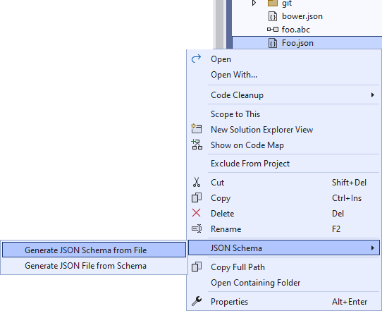

[marketplace]: https://marketplace.visualstudio.com/items?itemName=MadsKristensen.JSONSchemaGenerator2
[vsixgallery]: http://vsixgallery.com/extension/JsonSchemaGenerator.dbd91e6f-6362-4949-9b6c-c2d190ade159/
[repo]:https://github.com/madskristensen/JSONSchemaGenerator

# JSON Schema Generator

Download this extension from the [Visual Studio Marketplace][marketplace]
or get the [CI build][vsixgallery].

--------------------------------------

Allows you to easily generate a schema file from a JSON file and generate a JSON file with dummy data based on a schema file.

## Generate JSON Schema
Right-click your JSON file in the editor window and select **Generate JSON Schema...**. A new file will be created with the same name as the JSON file, but with the extension `.schema.json`.

You'll be asked where to place the generated file before it's being generated. Once created, the new schema will be applied to the document automtically.

## Generate files from a JSON Schema
If you already have a local JSON schema file, you can generate files in different formats based on it. 

### JSON
To generate a JSON file with dummy data, select the command **Generate JSON from Schema**. The new sample JSON file will automatically get the schema applied to it.

### C#
To generate a C# class file, select the command **Generate C# from Schema...**. This will open a dialog for you to select various settings.

### TypeScript
To generate TypeScript types based on the JSON Schema, select the command **Generate TypeScript from Schema**.

*Powered by [NJsonSchema for .NET](https://github.com/RicoSuter/NJsonSchema) written by [Rico Suter](https://github.com/RicoSuter)*

## How can I help?
If you enjoy using the extension, please give it a ★★★★★ rating on the [Visual Studio Marketplace][marketplace].

Should you encounter bugs or if you have feature requests, head on over to the [GitHub repo][repo] to open an issue if one doesn't already exist.

Pull requests are also very welcome, since I can't always get around to fixing all bugs myself. This is a personal passion project, so my time is limited.

Another way to help out is to [sponsor me on GitHub](https://github.com/sponsors/madskristensen).
